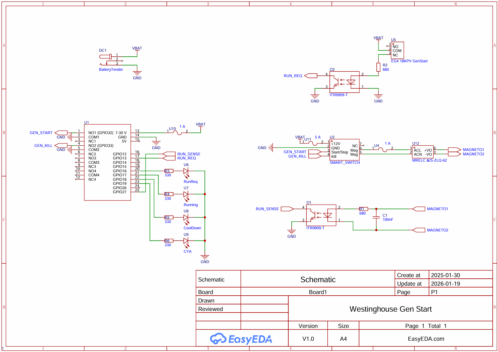
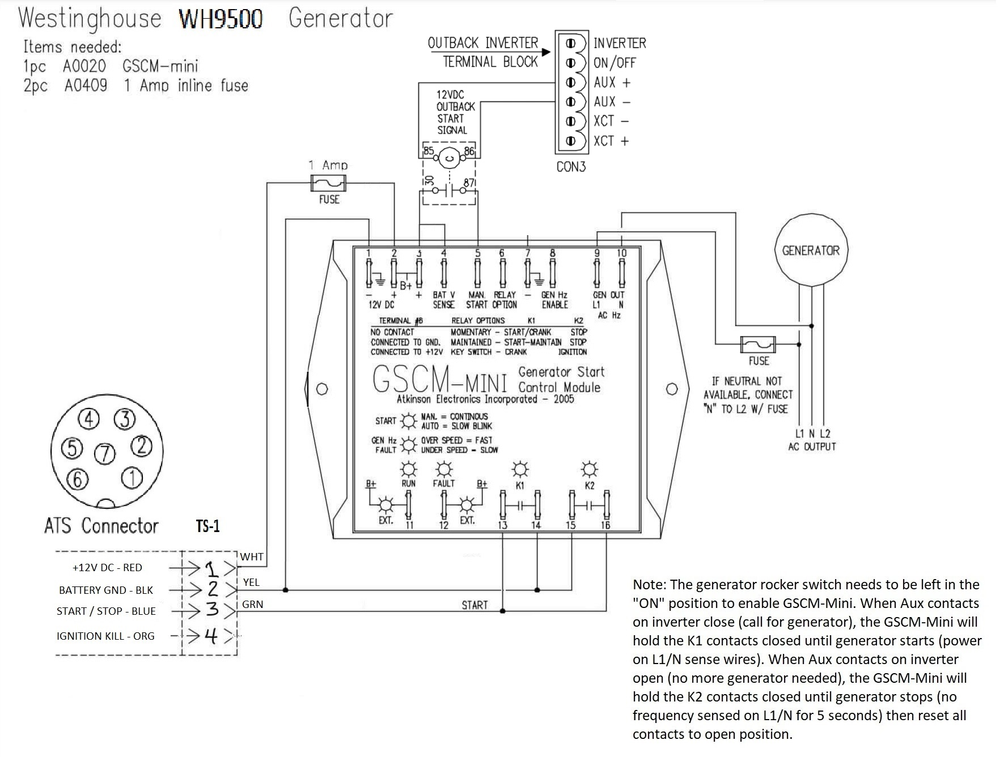

# Westinghouse Smart Switch Adapter

This project provides firmware for an ESP32-based adapter that automates the start/stop and maintenance cycle of a generator using relay outputs and status LEDs. The logic is implemented in `main.py` and is designed for use with Westinghouse (or similar) generators that can be remotely started and stopped via relay contacts.

## Features
- **Automated generator start/stop** based on external run request input
- **Cool-down cycle** after generator run
- **Scheduled maintenance runs** (e.g., once every 7 days)
- **Status LEDs** for run request, running, cool-down, and maintenance
- **Relay outputs** for start and kill generator functions
- **Debounced, non-blocking logic** using MicroPython's `asyncio`

## Pin Assignments
| Function                | ESP32 Pin |
|-------------------------|-----------|
| Run Request Input       | 13        |
| Run Request LED         | 16        |
| Running LED             | 17        |
| Cool Down LED           | 18        |
| Maintenance LED         | 19        |
| Run Sense Input         | 27        |
| Start Generator Relay   | 32        |
| Kill Generator Relay    | 33        |

## How It Works
- **Run Request:** When the run request input is active, the system starts the generator (if not already running) and resets the maintenance timer.
- **Cool Down:** When the run request is removed but the generator is running, a cool-down timer is started. After the cool-down period, the generator is stopped.
- **Maintenance:** If the generator has not run for a set number of days, a maintenance run is triggered for a fixed duration.
- **LEDs:** Indicate the current state (run request, running, cool-down, maintenance).
- **Relays:** Control the generator's start and stop (kill) circuits.

## Configuration
The system uses a `config.json` file to store configurable parameters. You can edit this file directly or use the web interface at `/config` to modify settings.

### Configuration Parameters
- **maintenance_interval_days** (default: 7): Number of days between scheduled maintenance runs.
- **maintenance_duration_minutes** (default: 10): Duration of each maintenance run in minutes.
- **cool_down_duration_minutes** (default: 15): Duration of the cool-down period after a run in minutes.
- **maintenance_start_hour** (default: 12): Hour of the day (0-23) when maintenance runs should start.
- **maintenance_start_minute** (default: 0): Minute of the hour when maintenance runs should start.
- **max_start_attempts** (default: 3): Maximum number of attempts to start the generator before giving up and ignoring further run requests until the request is cleared.
- **log_flush_interval_ms** (default: 30000): Maximum time between persisted log checkpoints.
- **log_flush_line_threshold** (default: 20): Number of new log lines that triggers an immediate persisted checkpoint.
- **persisted_log_max_bytes** (default: 262144): Maximum size of the bounded persisted log checkpoint kept in flash.

If the generator fails to start after the maximum attempts, the system will log the failure and stop trying until the run request is cleared (e.g., by turning off the external request signal).

## Bill of Materials

* [Enclosure](https://www.amazon.com/dp/B0BZ871TH3)
* [AC/DC Power Supply ESP32 Development Board 4 Way Channel 5V Relay](https://www.amazon.com/dp/B0DCZ549VQ)
* [Serial Adapter to Deploy Code](https://www.amazon.com/dp/B00LZVEQEY)
* [Optoisolators](https://www.amazon.com/dp/B09ZH6D7CQ)
* [Fuse Holders](https://www.amazon.com/dp/B0BF9LDW1P)
* [Fuses](https://www.amazon.com/dp/B07S96VTJR)
* [Panel-mount LEDs](https://www.amazon.com/dp/B0B2L9FP4R)
* [Rectifier](https://www.amazon.com/dp/B091MMPPZY)
* [GX20-7 Connectors](https://www.amazon.com/dp/B09BMYB9Y4)
* [Barrel Connector for Battery Tender](https://www.amazon.com/dp/B09Y1BBTZ2)
* A few additional passives (see schematic)

## Wiring Diagram

Below is the wiring schematic for the Westinghouse Smart Switch Adapter:



## Web Interface

The controller provides a WiFi access point and web interface for monitoring and testing.

### Connecting to the Web Interface
1. Connect to the WiFi network: **GenController**
2. Password: **westinghouse**
3. Navigate to: **http://gencontroller.local** or **http://192.168.4.1**

### Status Display
The web interface shows real-time system status:

- **Generator Running**: Indicates whether the generator is currently running (based on the run sense input)
- **Run Request**: Shows if there's an active request to run the generator (from the external run request input)
- **Cool Down Active**: Displays when the generator is in cool-down mode after a run
- **Maintenance Active**: Indicates when the system is performing a scheduled maintenance run
- **Days Until Maintenance**: Countdown timer showing time remaining until next scheduled maintenance run (format: Xd Xh Xm)
- **Start Attempts**: Number of consecutive start attempts since the last successful start

All status indicators update in real-time and include color-coded indicators (green when active, gray when inactive).

### Configuration Page
Navigate to `/config` to access the configuration interface. This page allows you to view and modify the system settings described in the Configuration section above. Changes are saved to the `config.json` file and take effect immediately.

### State Transition Log
The log section displays the last 50 state changes with timestamps. The following events are logged:

**System Events:**
- System startup and initialization

**Generator State Changes:**
- Generator running status changes (started/stopped)
- Run request input status changes (active/inactive)
- Start attempt failed (logged for each failed attempt)
- Start failure (logged when max attempts reached)

**Cool Down Cycle:**
- Cool down started (15 minute duration)
- Cool down finished

**Maintenance Cycle:**
- Scheduled maintenance started (10 minute duration)
- Maintenance finished
- Maintenance countdown updates (when days remaining changes)
- Maintenance timer reset (when generator runs from a request, resetting the 7-day countdown)

**Relay Control:**
- Start relay activated (generator starting)
- Start relay deactivated (various conditions: already running, no request, maintenance)
- Kill relay activated (stopping generator after cool down or maintenance)
- Kill relay deactivated (generator stopped)
- Stop failure (logged if generator doesn't stop within 30 seconds)

Timestamps are automatically converted to your local time zone based on your device's clock. Events are displayed with newest entries first.

To survive watchdog resets, the controller checkpoints the in-memory log to flash every 30 seconds or every 20 new entries (whichever comes first). On boot it hydrates the normal RAM log from the persisted checkpoint, and once the browser reconnects it backfills stable wall-clock timestamps for restored pre-reset entries that were captured before time sync.

## Watchdog Timer

The firmware enables the ESP32 hardware watchdog (`machine.WDT`) immediately after the WiFi access point is brought up. This ensures the device automatically resets if it hangs, crashes, or becomes unresponsive (e.g. due to a networking deadlock or unexpected exception).

- **Timeout:** 8 seconds (tunable via the `timeout` argument to `machine.WDT` near line 70 of `main.py`).
- **Feed point:** The watchdog is fed once per iteration of the `manage_start_stop()` coroutine, which runs every 200 ms during normal operation. A single missed iteration does not trigger a reset; the device must be unresponsive for a full 8 seconds before the hardware resets it.
- **Initialization safety:** The WDT is started *after* WiFi AP setup completes, so slow network bringup during boot does not cause a spurious reset.

To change the timeout, locate this line in `main.py`:

```python
wdt = machine.WDT(timeout=8000)
```

and adjust the value (in milliseconds). Keep it well above the 200 ms loop period to avoid false resets during normal heavy load; 8000 ms (8 s) is a conservative default.

## Usage
1. Connect the ESP32 pins as described above and in the diagram to your generator's remote start/stop interface and status LEDs.
2. Flash the ESP32 with MicroPython and upload `main.py`.
3. The script will automatically manage generator operation based on run requests and maintenance schedule.

## References

Similar project in C++ for rPI-pico [Westinghouse-12KW-transfer-switch](https://github.com/csvanholm/Westinghouse-12KW-transfer-switch/tree/main)

[Reddit thread](https://www.reddit.com/r/OffGrid/comments/mxygik/westinghouse_generator_automatic_transfer_switch/?rdt=50485) about another custom controller build with some details

Using OTS starter device $$$ [Westinghouse WH9500 / GSCM-mini Start Circuit](https://imgur.com/a/westinghouse-wh9500-gscm-mini-start-circuit-HQHf2BI)

