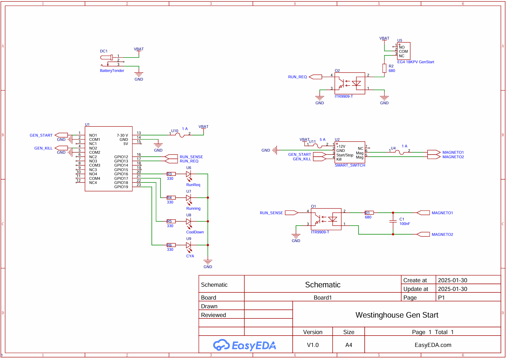

# Westinghouse Smart Switch Adapter

This project provides firmware for an ESP32-based adapter that automates the start/stop and maintenance cycle of a generator using relay outputs and status LEDs. The logic is implemented in `main.py` and is designed for use with Westinghouse (or similar) generators that can be remotely started and stopped via relay contacts.

## Features
- **Automated generator start/stop** based on external run request input
- **Cool-down cycle** after generator run
- **Scheduled maintenance runs** (e.g., once every 7 days)
- **Status LEDs** for run request, running, cool-down, and maintenance
- **Relay outputs** for start and kill generator functions
- **Debounced, non-blocking logic** using MicroPython's `asyncio`

## Pin Assignments
| Function                | ESP32 Pin |
|-------------------------|-----------|
| Run Sense Input         | 12        |
| Run Request Input       | 13        |
| Run Request LED         | 16        |
| Running LED             | 17        |
| Cool Down LED           | 18        |
| Maintenance LED         | 19        |
| Start Generator Relay   | 32        |
| Kill Generator Relay    | 33        |

## How It Works
- **Run Request:** When the run request input is active, the system starts the generator (if not already running) and resets the maintenance timer.
- **Cool Down:** When the run request is removed but the generator is running, a cool-down timer is started. After the cool-down period, the generator is stopped.
- **Maintenance:** If the generator has not run for a set number of days, a maintenance run is triggered for a fixed duration.
- **LEDs:** Indicate the current state (run request, running, cool-down, maintenance).
- **Relays:** Control the generator's start and stop (kill) circuits.

## Bill of Materials

* [Enclosure](https://www.amazon.com/dp/B0BZ871TH3)
* [AC/DC Power Supply ESP32 Development Board 4 Way Channel 5V Relay](https://www.amazon.com/dp/B0DCZ549VQ)
* [Serial Adapter to Deploy Code](https://www.amazon.com/dp/B00LZVEQEY)
* [Optoisolators](https://www.amazon.com/dp/B09ZH6D7CQ)
* [Fuse Holders](https://www.amazon.com/dp/B0BF9LDW1P)
* [Fuses](https://www.amazon.com/dp/B07S96VTJR)
* [Panel-mount LEDs](https://www.amazon.com/dp/B0B2L9FP4R)
* [Rectifier](https://www.amazon.com/dp/B091MMPPZY)
* [GX20-7 Connectors](https://www.amazon.com/dp/B09BMYB9Y4)
* [Barrel Connector for Battery Tender](https://www.amazon.com/dp/B09Y1BBTZ2)
* A few additional passives (see schematic)

## Wiring Diagram

Below is the wiring schematic for the Westinghouse Smart Switch Adapter:

## Usage
1. Connect the ESP32 pins as described above and in the diagram to your generator's remote start/stop interface and status LEDs.
2. Flash the ESP32 with MicroPython and upload `main.py`.
3. The script will automatically manage generator operation based on run requests and maintenance schedule.

## References

Similar project in C++ for rPI-pico [Westinghouse-12KW-transfer-switch](https://github.com/csvanholm/Westinghouse-12KW-transfer-switch/tree/main)

[Reddit thread](https://www.reddit.com/r/OffGrid/comments/mxygik/westinghouse_generator_automatic_transfer_switch/?rdt=50485) about another custom controller build with some details

Using OTS starter device $$$ [Westinghouse WH9500 / GSCM-mini Start Circuit](https://imgur.com/a/westinghouse-wh9500-gscm-mini-start-circuit-HQHf2BI)

